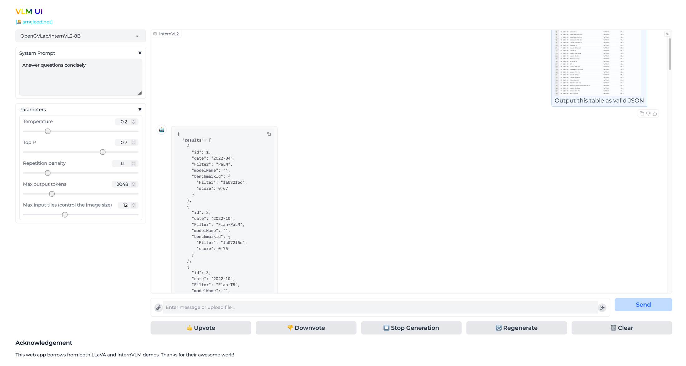

# VLM UI

VLM UI is a web-based user interface for interacting with various Vision Language Models (VLMs).

It provides a convenient way to upload images, ask questions, and receive responses from the model.



## Features

- Web-based interface using Gradio
- Support for multiple VLM models
- Image upload and processing
- Real-time streaming responses
- Dockerised deployment

## Prerequisites

- Docker
- NVIDIA GPU with CUDA support (for running models)

## Quick Start

1. Clone the repository:
   ```shell
   git clone --depth=1 https://github.com/sammcj/vlm-ui.git
   cd vlm-ui
   ```

2. Build and run the Docker container:
   ```shell
   docker build -t vlm-ui .
   docker run -d --gpus all -p 7860:7860 -e MODEL_NAME=OpenGVLab/InternVL2-8B vlm-ui
   ```

3. Open your browser and navigate to `http://localhost:7860` to access the VLM UI.

## Configuration

You can customize the behaviour of VLM UI by setting the following environment variables:

- `SYSTEM_MESSAGE`: The system message to use for the conversation (default: "Carefully follow the users request.")
- `TEMPERATURE`: Controls randomness in the model's output (default: 0.3)
- `TOP_P`: Controls diversity of the model's output (default: 0.7)
- `MAX_NEW_TOKENS`: Maximum number of tokens to generate (default: 2048)
- `MAX_INPUT_TILES`: Maximum number of image tiles to process (default: 12)
- `REPETITION_PENALTY`: Penalizes repetition in the model's output (default: 1.0)
- `MODEL_NAME`: The name of the model to use (default: OpenGVLab/InternVL2-8B)
- `LOAD_IN_8BIT`: Whether to load the model in 8-bit precision (default: 1)

Example:

```shell
docker run -d --gpus all -p 7860:7860 \
  -e MODEL_NAME=OpenGVLab/InternVL2-8B \
  -e TEMPERATURE=0.3 \
  -e MAX_NEW_TOKENS=2048 \
  vlm-ui
```

## Contributing

Contributions are welcome! Please feel free to submit a Pull Request.

## License

- Copyright Sam McLeod
- This project is licensed under the MIT License - see the [LICENSE](LICENSE) file for details.

## Acknowledgements

This app builds on the work of the following projects:

- [haotian-liu/LLaVA](https://github.com/haotian-liu/LLaVA)
- [OpenGVLab/InternVL](https://github.com/OpenGVLab/InternVL)
